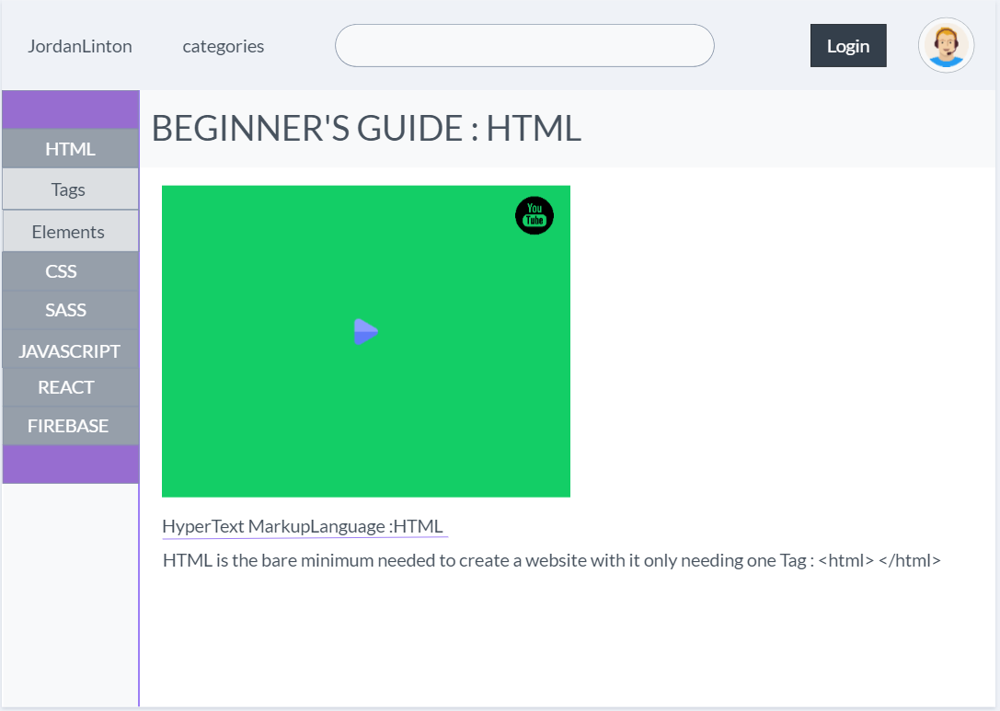

# Web Road Map Course

I Learnt so much doing this project from things such as search querys , and Firebase Authentication to basic image animations
---

## __inistial wire frames for my site__
__Home page__
---

## Intistial wireframe of 
__Sign-in/Up__
---

__Beginers Guide to Project__
---

